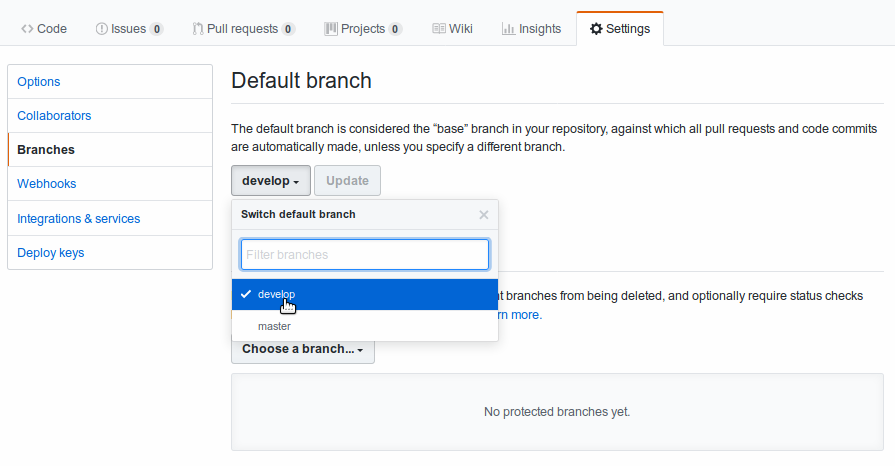
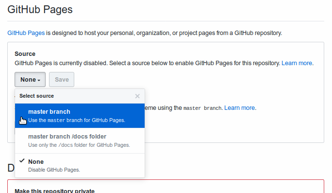
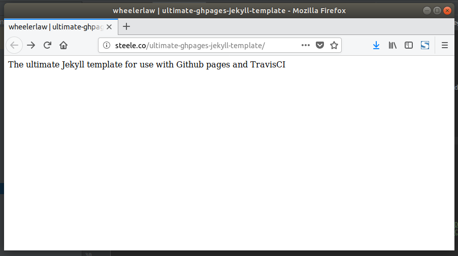

# ultimate-ghpages-jekyll-template
[](https://travis-ci.com/wheelerlaw/ultimate-ghpages-jekyll-template)

### The ultimate Jekyll template for use with Github pages and TravisCI

## Getting Started

To use this template, first fork this repo. 

Then configure the default branch to be `develop` (if you haven't already done so):


Next, configure the repo settings to use Github pages like so:


Currently this template only supports setting the `master` branch as the Github Pages source. 

Next, navigate to the page for the repo (in this repo's case, [wheelerlaw.github.io/ultimate-ghpages-jekyll-template](http://wheelerlaw.github.io/ultimate-ghpages-jekyll-template)):


## Build System

This template comes with a pre-configured `.travis.yml` ready for easy continuous deployment of your website. All you need to do is add your Github API token to the `env` section of the repo's `.travis.yml` with the following command:

    travis encrypt --pro GITHUB_TOKEN=<your_github_api_token> --add env
    

## Using The Template Locally

Installing depdencies:
```sh
sudo apt-get install ruby-dev
sudo gem install jekyll jekyll-paginate rake
```

Build the site:
```sh
jekyll build
```

You can alternatively use jekyll to serve the site locally without having to push it to GitHub:
```sh
jekyll serve
```

## Contributing To Your Website

This template uses a simple multi-branch deployment model to separate the deployed code on the `master` branch from the trunk development branch, `develop`. 

Notable branches:
 - `develop`: This is the "master" branch of the repo, if you will. When you are starting a new feature, branch from here. This is also the branch against which you will create pull requests. Furthermore, Travis listens for changes on this branch to deploy to `master`.
 - `master`: The contents of this branch are served to the public by GitHub pages and are built automatically by Travis when a pull request to `develop` is merged. **Do not touch this branch for any reason.** 


Before you clone the repository, there are some settings you should set:
```
git config --global push.default current
git config --global user.name "<insert your name here>"
git config --global user.email "<add your email address you use to sign into GH here"
```

To get started developing, first clone the repo if you have not already done so:
```
git clone https://github.com/wheelerlaw/ultimate-ghpages-jekyll-template.git
cd ultimate-ghpages-jekyll-template
```

If you have just cloned the repo, you can probably skip this next step. Otherwise, checkout `develop` and pull the latest changes:
```
git checkout develop
git pull
```

Create your feature branch off of `develop`. There is no enforced naming convention for feature branches, but most branch names are all lower case with words separated by underscores. PLEASE PLEASE PLEASE make it descriptive as to what the feature is (please):
```
git checkout -b your_feature_branch
```

Build (and serve up) the website locally and navigate to http://localhost:4000/ to view your changes before you push them:
```
jekyll serve
```

Now commit your changes and push them:
```
git add -A
git commit -m "Add some human readable, descriptive commit message."
git push -u 
```
Note: `-u` is only needed on the `git push` if the branch does not exist in `origin` (the repo in Github). 

Now, go to Github and create a pull request against `develop`. Get an admin for your repository to sign off on your changes and merge the PR into `develop`. 

Wait a few minutes and your changes will show up on the site. You might need to clear your browser cache. 
